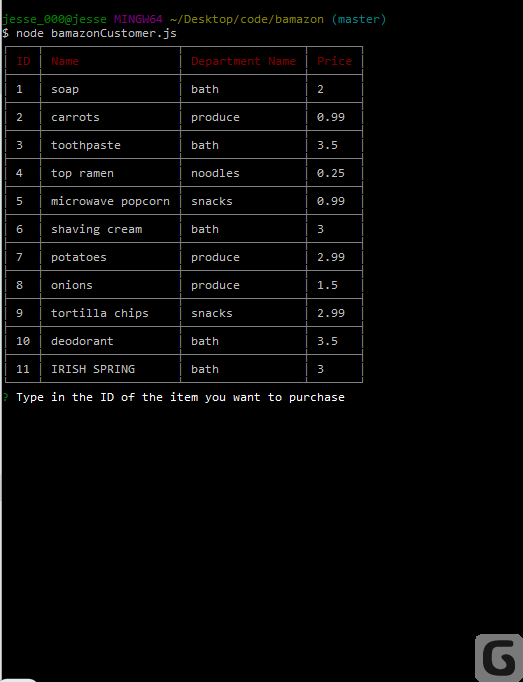
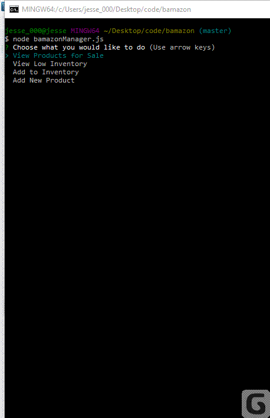
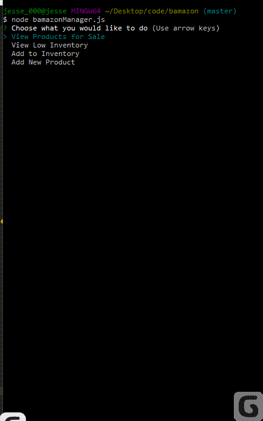

# Bamazon

## Overview

A command line app that functions as a storefront i.e. Amazon that interacts with a database containing products via MySQL and NodeJS. Clients can either use the app as a customer, which allows them to view products and make purchases, or a manager, which allows them to view products, see low inventory, add to inventory, or add a new item.

## Customer View

- View Products
- Purchase item 

## Manager View

 - View Products,
 - See Low Inventory
 - Add to Inventory
 
 - Add New Item 
 

## Stack

- NodeJS
- MySQL
- Inquirer
- CLI Table